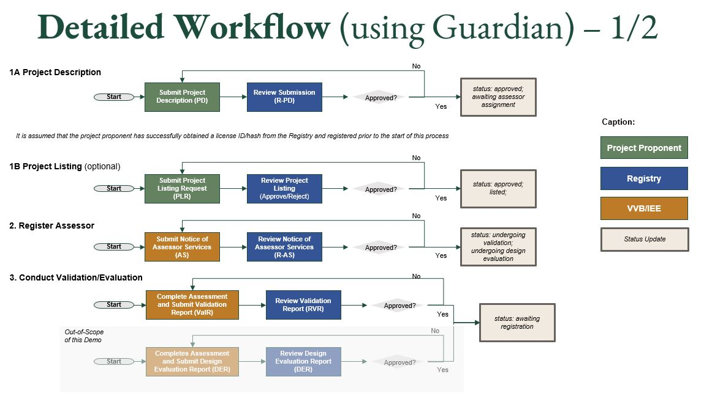
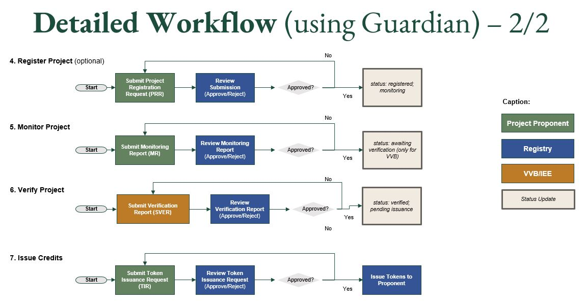

# Climate Defenders

## Table of Contents

- [Introduction](#introduction)
- [Policy Overview](#policy-overview)
- [Workflow Overview] (#workflow-overview)
- [Roles and Responsibilities](#roles-and-responsibilities)
- [Tokens](#tokens)
- [Getting Started](#getting-started)

---

## Introduction

The SDVista program, developed by Verra, aims to provide a standardized framework for assessing and quantifying the benefits of sustainable development interventions. One of the methodologies within this program is SDVM001 Improved Cook Stove (ICS), which focuses specifically on measuring the time savings resulting from the adoption of improved cook stoves. This methodology enables project developers to calculate and report the time saved by households using ICS compared to traditional cooking methods, contributing valuable data to support sustainable development initiatives.

The use of the Hedera Guardian platform further enhances this process by providing a secure, decentralized, and transparent platform for data management. Hedera Guardian leverages blockchain technology to ensure the integrity and immutability of data, enhancing trust and reliability in the information collected and reported. Additionally, Hedera Guardian offers real-time visibility into data transactions, allowing stakeholders to track and verify the authenticity of data throughout the project lifecycle. This level of transparency not only increases accountability but also facilitates greater collaboration and trust among project participants and stakeholders.

Moreover, Hedera Guardian's decentralized nature eliminates single points of failure and reduces the risk of data manipulation or tampering. This enhances the overall security of the SDVista program, safeguarding sensitive information and ensuring compliance with data privacy regulations. By leveraging Hedera Guardian, the SDVista program can achieve greater accuracy, efficiency, and trustworthiness in assessing the impact of sustainable development interventions such as the adoption of improved cook stoves.

This work was developed by participants of the DLT Climate Hackathon introduced by DLT Science Foundation (DSF), in collaboration with The HBAR Foundation Sustainable Impact Fund.

DLT Earth’s mission is to build a more accountable and impactful ecosystem to work towards rectifying the catastrophic impacts of climate change by reinforcing the integrity and efficacy of sustainable finance, climate project methodologies, sustainability markets, and ESG reporting. 

## Policy Overview

Millions of households across the world still rely on inefficient cooking devices, such as open fire, three-stone fires, and basic charcoal cookstoves. The time required to collect fuel and cook using these inefficient stoves prevents individuals from engaging in more valuable activities such as education, income-generation, or physical and mental health maintenance, child-rearing, etc.

This methodology provides guidelines for the quantification of time savings achieved through the introduction of improved cookstoves (ICS), replacing existing inefficient cooking devices in the household, or retrofitting existing installations. The methodology measures two types of time savings: (i) time spent cutting, collecting, and carrying cooking fuel, and (ii) time spent cooking.

The time savings arise mostly for women and girls who traditionally perform the hard and time-consuming work of cutting, collecting, and carrying heavy loads of firewood over long distances and who spend long hours tending inefficient open fires while cooking over them.

Additional benefits not quantified by this methodology include positive health outcomes: 1) reduced muscle and nerve damage for women and girls from not having to frequently carry heavy loads on their heads and from reduced risk of falls and physical abuse while outside their villages; and 2) reduced personal exposure to PM2.5 and other toxins in biomass smoke.

Reference:
https://verra.org/methodologies/time-savings-from-improved-cookstoves-ics/

## Workflow Overview

###Manual Workflow (Without Guardian)

###Workflow Using Guardian

## Roles and Responsibilities

1. **Project Proponent**:
   - Entities with overall control and responsibility for projects or programs. 
   - They establish and operate projects and programs in accordance with the SD VISta rules. They are responsible for providing the project description, monitoring report and supporting documentation (including evidence of project ownership) to facilitate validation and verification.
   - They sign unilateral representations with respect to their projects and SD VISta assets, and these are made available on the Verra project database. Project proponents assume limited liability for replacement of excess SD VISta assets.
   
2. **Validation/ Verification Bodies (VVBs)**:
   - VVBs are accredited to:
      - 1. Validate that a project’s design, and verify that its implementation, meet the rules and criteria of the SD VISta Program.
      - 2. Verify SD VISta assets. 
      - 3. Assess methodology elements under the methodology approval process.

   - They must meet the relevant criteria set out in Sustainable Development Verified Impact Standard and sign the required agreement with Verra before they can perform validation or verification under the SD VISta Program.
   - IEEs are also assessors. Unlike VVBs, however, IEEs are approved on a per-assignment basis and must meet the criteria set out in SD VISta and be approved by Verra on a per-evaluation basis. For the purposes of the Hackathon and this demo, we have excluded the IEE flow from the Guardian.

3. **Registry**:
   - Verra is responsible for maintaining a database of SD VISta projects, sourced from its registry, which provides public and searchable information on all projects have ever been listed under the SD VISta Program. 
   - The Verra project database provides full transparency on SD VISta project documentation and information about the project proponent. The Verra project database also hosts projects certified to other Verra standards such as the VCS and the Climate, Community & Biodiversity (CCB) Standards. SD VISta projects that issue Verified Carbon Units (VCUs) will see the SD VISta label reflected on those units in the Verra project database. 
   - It ensures that all required project documents have been submitted, maintains accounts of SD VISta assets, issues and facilitates the seamless flow of SD VISta assets between registry accounts, maintains custody and records of SD VISta asset legal ownership, and ensures that SD VISta labels are added to VCUs, where the project also verifies under the VCS Program. SD VISta asset serial numbers are generated by the registry, which ensures their uniqueness. Information sourced from the registry on project listings, SD VISta asset issuance and retirement are reflected publicly on the Verra project database. 

## Tokens

The SD VISTa SDVM001 Improved Cookstove (ICS) Methdology introduces three types of distinctive outputs:

- Claim: A claim is a verified statement of a project’s measured benefit that all SD VISta projects may generate regardless of the assessment pathway they choose.
- Label: A label is a marker affixed to a social or environmental credit. It demonstrates that the project that generated the credit is also verified to SD VISta.
- Asset: An asset is a tradeable credit that represents a unique sustainable development benefit that has been quantified through an SD VISta methodology/SDVM001.

For the sake of this demo, our design focuses on one token - the asset as a fungible, tradeable Time Savings Unit (TSU) token.

## Getting Started

Import the .policy file into your Guardian instance.
Follow the setup instructions to initiate your role in the policy.

